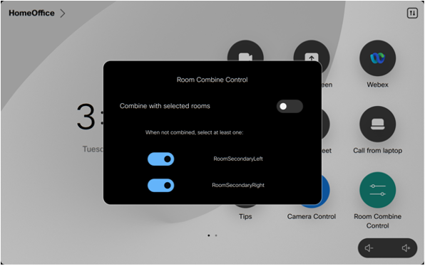
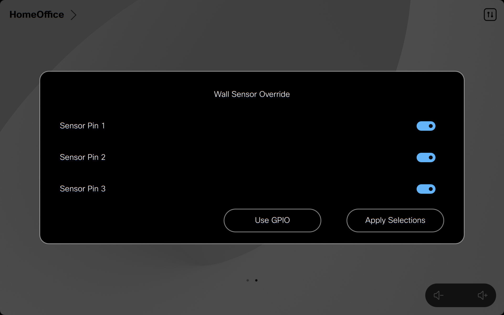
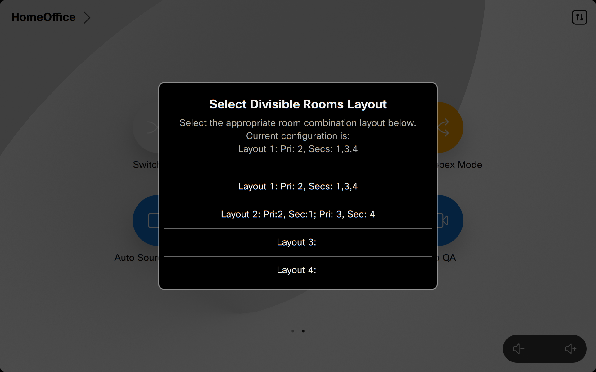
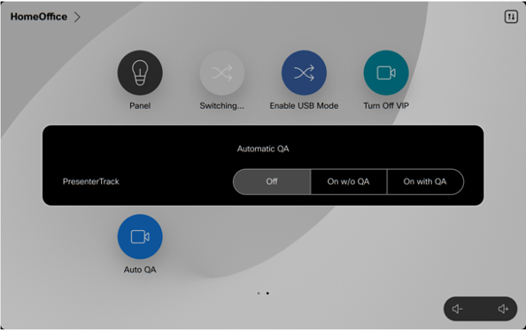

# GVE DevNet N-Way Divisible Conference Rooms Webex Devices Macros

Macros to automate dividing and combining conference rooms with Webex Codec Pro and Webex Codec EQ devices so that the same equipment can be used in both modes to join conference calls. This Macro can be used for setups consisting of two rooms that can be combined into one large room, but also for more complex designs where there are up to four rooms that need to be combined or devided as long as they are contiguous and on of the rooms is designated the primary which always has to be part of any combination.

| RoomOs Minimum Version | Webex Cloud | Webex Edge (Hybrid Cloud) | On-Premise | Microsoft Teams Room On Cisco Devices |
| ---------------------- | ----------- | ------------------------- | ---------- | ------------------------------------- |
| 10.17.1.0              | Yes         | Yes                       | Yes        | No - API Limitation                   |

Check the [Change Log](CHANGELOG.md) in this repository for the most recent changes and fixes to this macro.

NOTE: Support for the Codec EQ has not yet been reflected in the system drawings as an option or mentioned in the Instalation Instructions, but the macro has been changed to accomodate the smaller number of connectros on that device. If you wish to use Codec EQ devices, they must have the AV Integrator Software Option Key installed.

## Contacts

- Gerardo Chaves (gchaves@cisco.com)

## Solution Components

- Webex Collaboration Endpoints
- Javascript
- xAPI

## Requirements

- Minimum RoomOS version 10.17.1
- If running RoomOS 11 , minimum version is 11.2.1.0
- Codec Pro or Codec EQ with QuadCam or SpeakerTrack 60 camera array on each room (SP60 support is experimental)

## Installation/Configuration

Follow the [Version 3 Two-way System Drawing](./Version_3_Two-way_System_Drawing.pdf) diagrams for hardware setup.

For configuration setup and further hardware setup instructions, refer to the [Installation Instructions for N-Way Divisible Conference Rooms Version 3.1](./Installation_Instructions_for_N_Way_Divisible_Conference_Rooms_Version_3_1.pdf) document in this repository.

Install GMM_Lib.js and divisible_room.js on each codec (primary and secondary)

If you wish to use the USB Mode v3 macro for USB passthru , install the USB_Mode_Version_3.js macro onto the codec(s) you wish to use it with.

NOTE: If you need to replace a codec that was already configured with this macro and wish to preserve the Camera presets, consider using this macro to make a backup of the presets for later restoring:
https://github.com/wxsd-sales/camera-presets-backup-restore-macros

Here is a summary of each macro in this repository:

### GMM_Lib.js

This is a library shared by various Webex Device macros that simplifies communication between codecs and modules on the same codec.  
More details at: https://github.com/CiscoDevNet/roomdevices-macros-samples/tree/master/Global%20Macro%20Messaging

### USB_Mode_Version_3.js

This module is optional. It is a Beta version of the USB Mode V3 macro. The new RoomOS 11 USB Passthrough mode is now supported in this divisible room macro.

### divisible_room.js

This is the main module meant to work together with the optional USB Mode version 3 , div_layout_handler and div_layout_select modules via events on the same codec and across codecs with the GMM library.  
In addition to handling configuration changes when combining or splitting rooms and switching video inputs based on active speakers, it handles communications needed between Primary and Secondary codecs to keep the codec awake and set the correct video layouts

IMPORTANT: Turn on the divisible_room macro on the Primary codec before turning it on in secondaries to give the macro a chance to set up the correct Join/Split state according to what is reflected in permanent storage. Also, turn on only the divisible_room macro and optional div_layout_select (main primary codec) or div_layout_handler (all others) on each codec. DO NOT turn on the GMM_Lib macro, it is just a library included by the other two.

### divisible_config.js

Once you have installed divisible_room.js in all codecs in the solution, install divisible_config.js and edit as needed the values in sections 1 through 6 of that file before turning on the divisible_room macro. NOTE: You do not need to ever turn on the divisible_config macro.

Detailed instructions on each settings in those sections are provided in the divisible_config macro itself in the form
of code comments.

If you need to support advanced layouts or more than 1 wall sensor, set the JS_MULTI_ROLE constant to true and follow the instructions
to create multiple profile_LAY profiles and fill out the THIS_CODEC_IP, LAYOUTS and L_WALLS constants accordingly. You also need to install the div_layout_select.js macro on the codec you design as main primary and the div_layout_handler macro into all other codecs in the solution.

NOTE: Never change the Video Monitors, Ultrasound MaxVolume, WakeupOnMotionDetection or StandbyControl settings on the Secondary codec while in combined mode. These settings are stored when going from split to combined mode to restore once back in split mode so if you change them while combined the wrong settings could be stored away in persistent memory. The safest option is to set those on either codec only in split mode and while the macro is off.

### div_layout_select.js

This module is optional. It is meant to be installed in the main primary codec for advanced layouts where you might need to switch a seconary codec to primary to support more layouts. It's function is to provide new custom panels to manually select advaced layouts and communicate with the div_layout_handler macro running on all other codecs to switch layouts and restart the macro subsystem there and also on the main primar codec. It also has the ability to interact with an external controller managing up to 3 wall sensors (or directy connected sensors) with up to 3 GPIO PINS to indicate status of sensors and switch layouts accordingly. If your installation will always have the same roles for all rooms and does not need to support more than one wall sensor you do not need to intall nor enable this macro.

In this macro, you can control the User Interface elements it offers to set advanced layouts. I you just want to select amongst the advanced layouts but use the regular Combine Control custom panel to combine/divide rooms, set the SHOW_PANEL_LAYOUT_SELECT constant to true so you have access to the "Divisible Layouts" custom panel.

If you wish to automate the setting of layouts plus specific combine/divide settings and have a way to overwrite wall sensor reading or do not have any wall sensors, set the SHOW_PANEL_WALL_SENSOR_OVERRIDE constant to true so you have access to the "Wall Sensor Override" custom panel.

### div_layout_handler.js

This module is optional. It is meant to be installed on all other codecs except the the main primary codec for advanced layouts where you might need to switch a seconary codec to primary to support more layouts. It's function is to listen to messages from the the div_layout_select macro on main primary codec and switch around advanced layouts when needed and restart the macro subsystem. If your installation will always have the same roles for all rooms and does not need to support more than one wall sensor you do not need to intall nor enable this macro.

## Usage

Once the macros are running and have done the initial configuration, you can switch room configurations from joined/combined to split/standalone by either triggering the wall switch with the divider wall between them or manually on the Touch10 or Navigator associated to the Primary codec by invoking the custom "Room Combine Control" panel:

If you only have one Primary and one secondary, you can also use the USE_WALL_SENSOR constant in divisible_room.js of the Primary codec to indicate if you will use that to switch.

If you have more than one wall sensor and/or you need to be able to switch the role of a codec in the solution from Primary to secondary and vice-versa, you would have configured multiple profile_LAY entries and will have a new custom panel named "Wall Sensor Override" from which you can manually set the state of the various room partitions which in turn will apply the appropriate layouts and set the corresponding combine/divide states of all codecs.

You can also use the custom panel labeled "Divisible Layouts" to only select the overall layout to use without specifying which rooms are combined or split so you can then use the Room Combine custom panel on the primary to manually select and combine/divide with secondary codecs.

To trigger the automatic switching behavior between rooms when combined, either connec to a call or manually turn on SpeakerTrack on the quadcam.

If you turn off SpeakerTrack manually while in a call, the automatic switching will pause until you turn it back on again. During this time, you can select another camera in the codec, such as a PTZ camera focused on a Whiteboard, which will be used in the call and even when there is audio activity in the secondary room the macro will not switch to that camera until you turn speakertrack back on.

During a call, you can use the Auto Q&A custom panel button to turn on PresenterTrack with our without the Q&A mode option. When in Presenter Track mode with with Q&A mode enabled, the macro will take care of keeping the focus on the presenter and if a question comes in from the audience from either room it will compose the image of the presenter plus the audience member while they are talking and a few seconds afterwards (controlled by the PRESENTER_QA_KEEP_COMPOSITION_TIME configurable constant in the macro) it will focus back only on the presenter; this behavior is similar to the native "Classroom Mode" which is not compatible with this macro. If you select PresenterTrack without the Q&A mode option, the macro will make sure the presenter is always the one being shown in the call irrespective if anyone else in any of the rooms is speaking until you turn off PresenterTrack either via the custom panel or using the native camera controls of the codec.

The macro works when used in combination with the USB Mode v3 macro. Please note that when in USB Mode, you cannot combine or split rooms until you exit out of that mode.

NOTE: WebRTC support in RoomOS 10 (i.e. calls to Google Meet) in this macro is "experimental" due to lack of full support for camera swtiching when WebRTC calls. The switching in this is accomplished by temporarily muting video, switching and then turning back on with a 1.5 second delay so you will experience a blank screen being sent to the other end during that switching. Please note that if you turn off automation manually by turning off Speakertrack while in a WebRTC call, even if you select a different camera it will not be sent automatically to the other side since the "workaround" of muting for 1.5 seconds is disabled when the macro is not in automatic switching mode. In this situation, you must manually select the new camera to use, mute the outgoing video using the Touch 10 button, wait at least 1.5 seconds and then Un-mute the video also on the Touch10 button.  
For RoomOS 11 , there is full support for camera switching in WebRTC calls without the delays described above, but it still cannot compose two video inputs side by side in overview moder or in Presenter QA mode so in those situations the macro will just send one video input.

Note: On RoomOS 11.2, make sure you are not showing any self-view screen on the secondary codec when combining , this includes not being in the "Control Panel" in the Navigator or Touch 10 device for the secondary even after going Standby manually because when it comes back out it will go to that screen showing the Control Panel on the control device and selfview on the main screen and this triggers an unstable state on the secondary codec.

### LICENSE

Provided under Cisco Sample Code License, for details see [LICENSE](LICENSE.md)

### CODE_OF_CONDUCT

Our code of conduct is available [here](CODE_OF_CONDUCT.md)

### CONTRIBUTING

See our contributing guidelines [here](CONTRIBUTING.md)

#### DISCLAIMER:

<b>Please note:</b> This script is meant for demo purposes only. All tools/ scripts in this repo are released for use "AS IS" without any warranties of any kind, including, but not limited to their installation, use, or performance. Any use of these scripts and tools is at your own risk. There is no guarantee that they have been through thorough testing in a comparable environment and we are not responsible for any damage or data loss incurred with their use.
You are responsible for reviewing and testing any scripts you run thoroughly before use in any non-testing environment.
